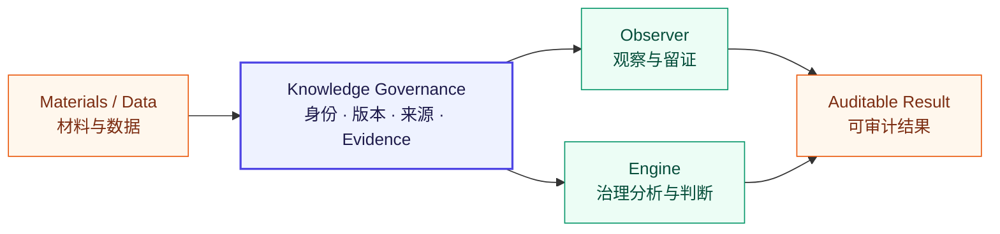

<div align="center">

# Full Spectrum Knowledge Governance

### 全频谱知识治理

**Turn knowledge into versioned, attributable and replayable evidence.**  
**把材料、数据与动态信息治理为可识别、可验证、可审计、可回放的知识依据。**

[](https://gitee.com/full-spectrum/full-spectrum-knowledge-governance/releases)
[](https://gitee.com/full-spectrum/full-spectrum-knowledge-governance/wikis/Home)
[](https://gitee.com/full-spectrum/full-spectrum-knowledge-governance/wikis/Home)
[](LICENSE)

[项目 Wiki](https://gitee.com/full-spectrum/full-spectrum-knowledge-governance/wikis/Home)
·
[Gitee Releases](https://gitee.com/full-spectrum/full-spectrum-knowledge-governance/releases)
·
[Observer](https://github.com/full-spectrum-lab/full-spectrum-observer)
·
[Engine](https://github.com/full-spectrum-lab/full-spectrum-engine)
·
[Full Spectrum Lab](https://github.com/full-spectrum-lab)

</div>

---

## What it is · 它是什么

Full Spectrum Knowledge Governance 是一个独立的知识供应与治理内核。它不负责替代 Observer 做观察，也不负责替代 Engine 做治理计算；它负责回答更基础的问题：

> 一条知识依据是谁提供的、属于哪个精确版本、适用于什么条件、经过什么治理过程，以及能否被独立验证和重放？

系统把原始材料转化为具备以下属性的工程对象：

- **Identity** — 稳定身份，而不是依赖文件名或“最新版”；
- **Exact Version** — 精确版本和生命周期状态；
- **Provenance** — 来源、适用范围与治理责任；
- **Evidence** — 可验证摘要、匹配轨迹和覆盖证据；
- **Audit** — 追加式事件记录与完整性检查；
- **Replay** — 固定输入和固定规则下的确定性回放。

## Where it sits · 在体系中的位置



| Component | Responsibility | Boundary |
|---|---|---|
| Knowledge Governance | 治理知识身份、版本、来源、匹配、证据与回放 | 不依赖 Observer 或 Engine |
| Observer | 在真实运行边界观察主体、上下文、行为与证据 | 不改写知识治理事实 |
| Engine | 使用明确输入和治理规则进行分析、判断与输出 | 不充当知识事实源 |

## Current engineering state · 当前工程状态

> 当前版本是可验证的早期工程内核，不是生产级知识平台。

| Evidence gate | Current result |
|---|---|
| Release line | `v0.1.0-alpha` |
| Automated tests | `70 / 70` |
| JSON Schema | `12`, Draft 2020-12 |
| Golden stages | `K0-01` ～ `K0-05` |
| Persistence | SQLite, `user_version = 3` |
| Verified platform | Windows x64 |
| Linux / macOS | Not executed |
| Production ready | **No** |

已经验证的最小链路：

```text
Contracts & Identifiers
        ↓
Registry & Artifact Store
        ↓
Fixed Resolution (Fail-Closed)
        ↓
Match Trace & Coverage Evidence
        ↓
Domain Profile / Taxonomy / Slot Mapping
```

每个阶段都保留 Schema、Golden CASE、测试结果和可核验摘要。动态知识、LLM、向量数据库、知识市场和多组织网络不属于 `v0.1.0-alpha` 已交付范围。

## Evidence first · 证据优先

这里的“通过”不是一句项目描述，而应当能够落到一条完整证据链：

```text
Requirement
→ Schema
→ Implementation
→ Automated Test
→ Golden CASE
→ Audit / Replay
→ Release Artifact
```

正式版本、复测报告、已知限制和工程规划以以下入口为准：

- [项目 Wiki：需求、架构、测试与阶段门](https://gitee.com/full-spectrum/full-spectrum-knowledge-governance/wikis/Home)
- [Gitee Releases：正式发布事实与制品](https://gitee.com/full-spectrum/full-spectrum-knowledge-governance/releases)
- [Observer：消费治理知识并形成观察证据](https://github.com/full-spectrum-lab/full-spectrum-observer)
- [Engine：执行治理分析与结构化输出](https://github.com/full-spectrum-lab/full-spectrum-engine)

## Roadmap · 收窄式路线

| Version direction | Goal | Explicit non-goals |
|---|---|---|
| `v0.1.x-alpha` | 固定知识治理内核与发布证据闭环 | 不扩展智能化能力 |
| `v0.2.x-alpha` | 稳定调用契约、Library API、Adapter SPI | 不依赖 Observer / Engine |
| `v0.3.x-alpha` | 动态知识生命周期和变更治理 | 不引入知识市场 |
| Later | Observer、Skill、LLM 等外部适配 | 固定内核仍保持可重放 |

下一阶段优先级不是“增加更多功能”，而是让代码事实、版本事实、文档声明、测试证据与发布制品始终指向同一个对象。

## Repository role · 本仓库定位

本仓库是 Knowledge Governance 在 GitHub 上的**公开说明与证据导航入口**。当前正式工程事实、版本文档和发布制品首先维护在 Gitee。

因此：

- 本仓库不把 Wiki 规划冒充已经实现的代码；
- Gitee 与 GitHub 比较内容、版本和交付物，不要求提交 hash 相同；
- 任何“已发布”“已验证”“生产可用”的声明都必须有对应证据；
- GitHub 正式源码仓库将在 Gitee 形成适合公开同步的稳定版本后建立或迁入。

## License

项目采用国内外双许可证策略：

- 中国境内：MulanPSL-2.0；
- 国际协作：Apache-2.0。

具体文件和制品适用方式以对应发布包内的许可证声明为准。本导航仓库当前包含 Apache-2.0 许可证正文。

## Project family · 项目家族

| Repository | Role |
|---|---|
| [full-spectrum-protocol](https://github.com/full-spectrum-lab/full-spectrum-protocol) | 协议、Schema 与互操作合同 |
| [full-spectrum-engine](https://github.com/full-spectrum-lab/full-spectrum-engine) | 治理能力引擎 |
| [full-spectrum-observer](https://github.com/full-spectrum-lab/full-spectrum-observer) | 本地优先的观察与证据控制台 |
| [full-spectrum-commons](https://github.com/full-spectrum-lab/full-spectrum-commons) | 公共资产与社区材料 |
| [full-spectrum-enterprise-governance](https://github.com/full-spectrum-lab/full-spectrum-enterprise-governance) | 企业治理语境与实践入口 |

---

<div align="center">

**Knowledge becomes governable only when every claim can point back to identity, version, source and evidence.**

知识只有能够回指身份、版本、来源和证据时，才真正可治理。

</div>
